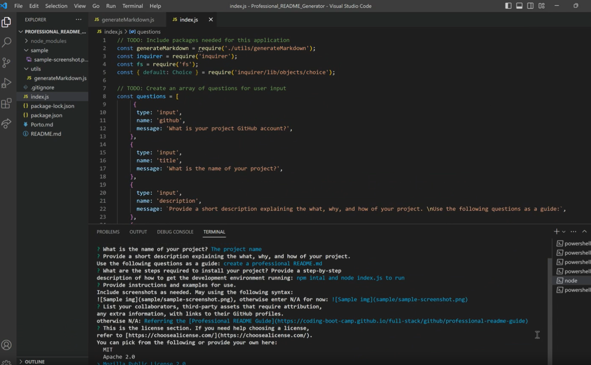

# Professional README Generator


## Description

You can quickly and easily create a README file by using a command-line application to generate one. This allows the project creator to devote more time to working on the project.

## User Story

```md
AS A developer
I WANT a README generator
SO THAT I can quickly create a professional README for a new project
```
## Preview



## How 

By using a user's input and the [Inquirer package](https://www.npmjs.com/package/inquirer/v/8.2.4) to create a command-line application that dynamically generates a professional README.md file; Referring the [Professional README Guide](https://coding-boot-camp.github.io/full-stack/github/professional-readme-guide).

The application will be invoked by using the following command:

```bash
node index.js
```

Because this application won’t be deployed, here is a walkthrough video that demonstrates its functionality.

Click the link for the [Demonstration video](https://drive.google.com/file/d/1UELpF12FiC0BAFuZsK8HcyhNiQ-vOOrN/view)

## License

This project license is under the [MIT](https://opensource.org/licenses/MIT)

---