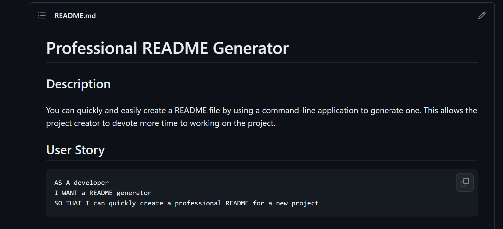

# Name Project Title


## Description

Create a profesional README.Md

## Table of Contents

- [Installation](#installation)
- [Usage](#usage)
- [Credits](#credits)
- [License](#license)
- [Badges](#badges)
- [Features](#features)
- [How to Contribute](#contribute)
- [Tests](#tests)
- [Contact](#contact)

## Installation

Npm (npm instal) and node index.Js to run

## Usage



## Credits

N/A

## License

Mozilla Public License 2.0

---

## Features

Create a sapmleREADME.Md

## How to Contribute

N/A

## Tests

N/A

## Contact
``````
If you have a question can reach via
Email: eliabefghhgf@gmail.com
More of my work: [eliabN](https://github.com/eliabN/).
``````